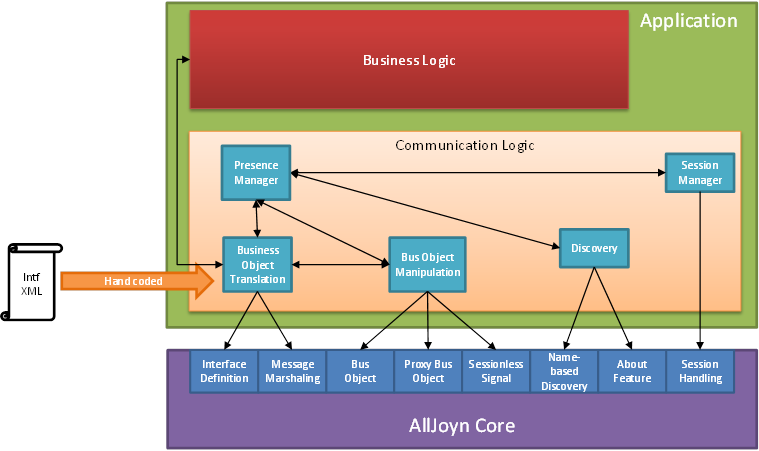
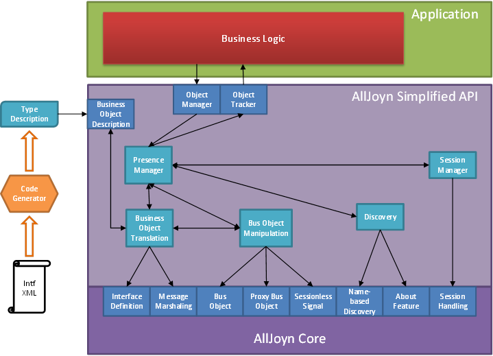

#AllSeen Simple API Project Proposal (DRAFT)

### Project Description

#### About AllJoyn

AllJoyn is a toolbox that offers a lot of fairly low-level functionality. With this toolbox, developers can create tailor-made solutions for their particular distributed application use case. This approach works great if you're building one-off, ad hoc distributed applications. In the Internet of Things context, however, there is a lot of value if devices and applications can transcend this silo mentality, and offer their services and information in a way that is standardized and reusable. Therefore, it no longer makes sense to have each device or application craft its own discovery and session management system out of the building blocks provided by AllJoyn.

#### Reusable Services Extensions

Building further on the theme of reusable services, we propose some extensions to the current AllJoyn type system. The goal of these extensions is to increase the expressiveness of the interface definition language in such a way that AllJoyn interfaces become much more self-describing. By describing an application's (or a device's) services in a formal definition language, and using a code generator to produce language bindings for this description, we can drastically improve the chances for interoperable implementations, while also increasing developer convenience. The proposed extensions to the type system have been described on the Alliance wiki:

https://wiki.allseenalliance.org/core/extensions_to_the_type_system_proposal|https://wiki.allseenalliance.org/core/extensions_to_the_type_system_proposal 

They have been discussed on the AllSeen Core mailing list.

#### Publish-Subscribe Extensions

In addition, the distributed many-to-many communication scenarios that arise with the advent of the Internet of Things map very well on the Publish-Subscribe information exchange paradigm. We'd like to introduce this paradigm as a first-class member of the AllJoyn APIs. Publish-Subscribe could then be used for the more data-oriented use cases (discovery, sensor readings, allowing a device to gather information about its surroundings, ...), while the traditional RPC model can play an important role in the configuration and control type of use cases.

#### Summary

In summary, we propose to create a simplified AllJoyn API that operates at a higher conceptual level than the current API. We aim to achieve this goal by:

* shielding application developers from the minutiae of discovery, connectivity and session management. Underneath the simplified API, there will be a common methodology for discovery and session setup.
* extending the AllJoyn type system, and leveraging a code generation tool, to allow developers to express their application logic more directly in terms of business objects.
* introducing the Publish-Subscribe paradigm for data-oriented use cases
* overall reducing the number of distinct API concepts a developer has to understand when programming for AllJoyn. This will reduce the steepness of the learning curve, and attract more developers to the AllSeen ecosystem.

 

### Architecture Diagrams

#### High-Level Diagram

The picture below describes the high-level architecture of an application built on top of the current AllJoyn API.

#### Communication Logic

The picture below shows how the proposed simplified API implements a lot of the application's communication logic in a standardized way, and exposes a more limited set of API concepts to the application developer.

### Scope and Completion Criteria

#### Scope

The scope of this API is detailed in the list below:

* Publish/Subscribe based mechanism
* Generalised interface discovery and session setup
* Simplified API and boilerplate code reduction
* Code generator updates taking into account the boiler plate reduction
* Extended type system and code generator to allow for:
** Optional fields
** Enums
** Named structs
* Sample implementation showcasing the usage of the new API's and code generator improvements
* Full documentation (Developer Guide, Reference Manual, Best Practices, ...) for the simplified API

#### Completion Criteria

* Consensus on the shape of the simplified API

* Simplified API integrated into AllJoyn core
* Language bindings available for all supported platforms

### Other Project Variables

#### Dependencies

This project will be part of the AllSeen _
    +
      *Core working group*
    +
  _ and will obviously depend on the work being done in this workgroup. There will also be a dependency on the _
    +
      *Developer Tools working group* +
  _for the proposed changes to the code generator to make use of the proposed improved marshaling mechanism.

#### Project Name

We propose the name of this project to be *simplified_API.*

We propose to start working on a separate GIT repository part of the core working group to get things started. It needs to be discussed within the workgroup whether this new API will be part of the AllJoyn GIT repository at some point.

#### Committers & Contributors

Maintainer: Dominique Chanet (Technicolor) - Lead Software Architect for Technicolor's AllSeen contributions

Committers:

* Technicolor
** Dominique Chanet
** Kristof Martens - Development Team Lead
** Steven Aerts, Paul Praet, As'ad Salkham, Ronny Vanhelmont, Kris Verbeeck - Software Engineers

#### Specific QA resources:

None. We are currently in a POC phase, but we might ramp this up in the future. We will write unit tests for the new API's that are going to be proposed and they will be part of the code deliveries that we intend to do.

#### Initial Contribution

Our initial contribution will consist of:

* Taking part in discussions between all parties to define a simplified API
* Writing working code and tests for C++
* Sample implementation showcasing the simplified API proposal
* At a later phase we will also contribute more extensive tests and documentation on how to use the new API's

#### Proposed Release Schedule

Our goal is to make deliveries that will fit within the AllSeen release schedule

##### AllSeen 14.6

This release will include the following:

* Propose a working POC simplified API including Pub/Sub support in C++
* Code generator for C++ POC based on extended marshalling support 
* Sample implementation making use of the new API's and code generator in C++

##### AllSeen 14.10

This release will include the following:

* Optimise core functionality to new API's
* Add additional language bindings
* Integrate new API's as intrinsic part of core
