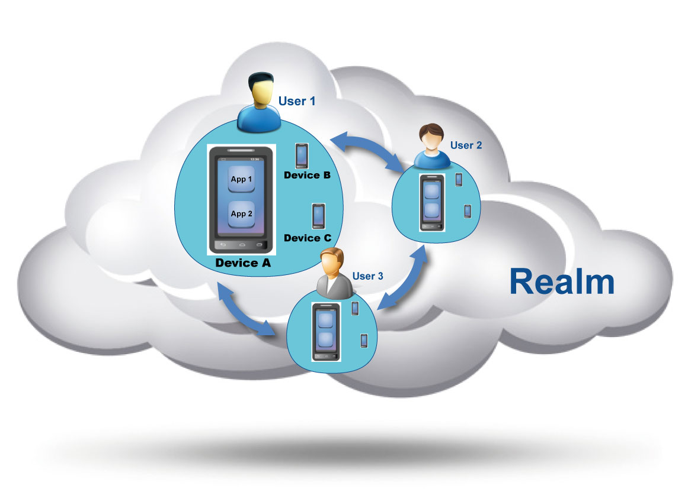
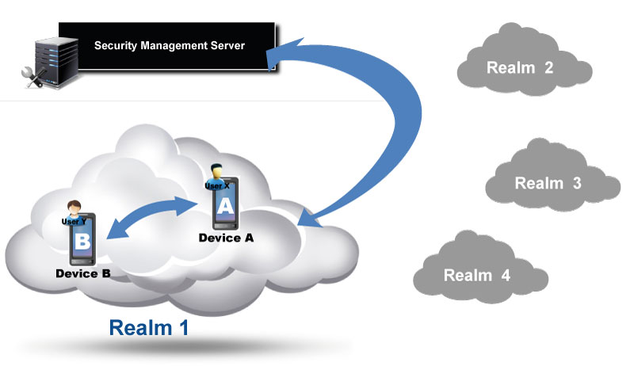

#### Introduction

The main goal of the Qeo security framework is to configure the boundaries of Qeo interactions between users, their devices and their applications.

The security framework is organized around the following hierarchy of entities :

* *Realm :* a set of users, devices and applications that can exchange information via Qeo Topics. A Realm is assigned a Realm ID by the Security Management Server (see below). 
* *User :* A User is an entity within a Qeo Realm that groups one or more Devices. A user is assigned a user id by the SMS.
\\ \\
 
* * Device:* A Device is an entity that hosts or runs Applications. These Applications read or write to Qeo Topics. A device is assigned a device id by the SMS.
\\ \\
 
* *Application :* An App or Application is an entity that either reads or writes to Qeo Topics. An application runs on a device.

The diagram below shows this hierarchy:

Qeo applications run on devices, assigned to a User. Currently, Qeo security is user-centric. Group your devices accordingly when using access control in Qeo. 

#### Security Mechanisms

Security is implemented by the following three mechanisms:

* *Registration and Authentication :* create a Realm, define Users for this Realm and register Devices for these Users. At device registration time the Security Management Server (SMS) authenticates the device of a user by means of the One Time Code (OTC). There are two ways of registering a device: local and remote. Go [here|Device Registration] for more information.
* *User-Level Access Control :* defines which Users are allowed to access which data. This is defined by the Qeo security policy applicable within a realm.
* *Application-Level Access Control :* defines which Applications are allowed to access which data. This is defined by the Qeo manifest file accompanying the Qeo application.

In order for two applications to successfully exchange data over Qeo, each of these security mechanisms needs to be configured correctly:

* _The Realm Administrator_ needs to allow the devices (on which the applications are running) to his Realm.
* _The Realm Administrator_ needs to allow the User to access specific data topics by configuring the Qeo security policy accordingly.
* _The User_ needs to allow the application to access specific data topics that are expressed in its application manifest file.

 

#### Architecture

Security is managed through a central server: the _Security Management Server_. This SMS can be used to create and configure a Realm and its corresponding Qeo security policy. Once the security policy is available to the different devices in the Realm, the devices can interact directly according this security policy without any further interaction with the Security Management Server. When the Qeo security policy gets updated (e.g. because a user is added or a user has been given different access rights to the Qeo topics) all devices in the realm need to apply this latest policy file to act in sync and according this latest Qeo security policy.

Users/Device/App combinations in Realm 1 are able to talk Qeo to each other, whereas they are unaware of anyone in other Realms and vice versa. Each Realm is separate from another.

#### Location of the SMS

The SMS is located here:

[http://my.qeo.org/|http://my.qeo.org/]

#### More Information

More information on the different security mechanisms can be found on:

